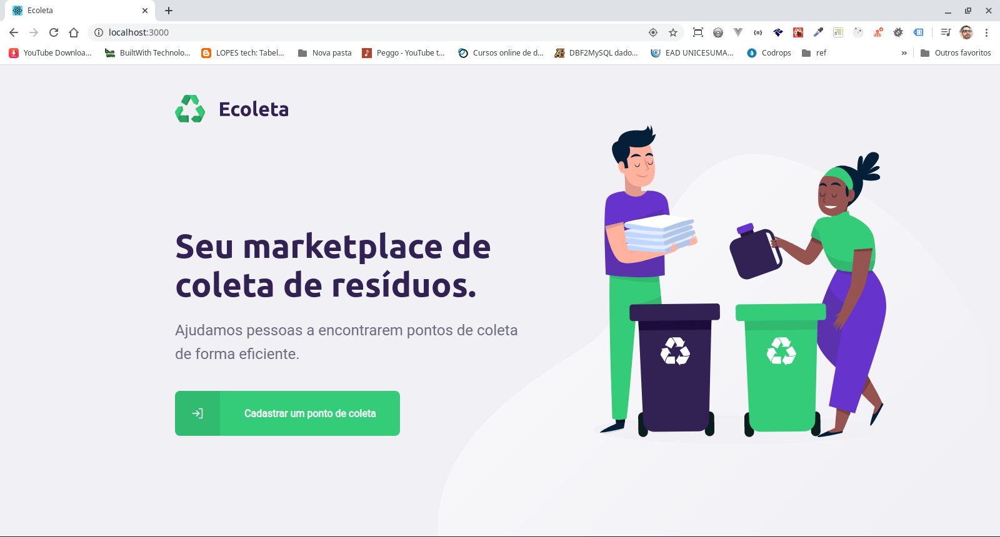

<h1 align="center">
    
</h1>

<h3 align="center">
  Ecoleta - Backend, frontend e mobile
</h3>

  

  

## :rocket: Sobre o Projeto  

Construir um projeto onde é possível se cadastrar pontos de coleta para descarte de resíduos de diversos materiais.

---

## Pagina Home

## Stack
* Node.js
* React
* React Native